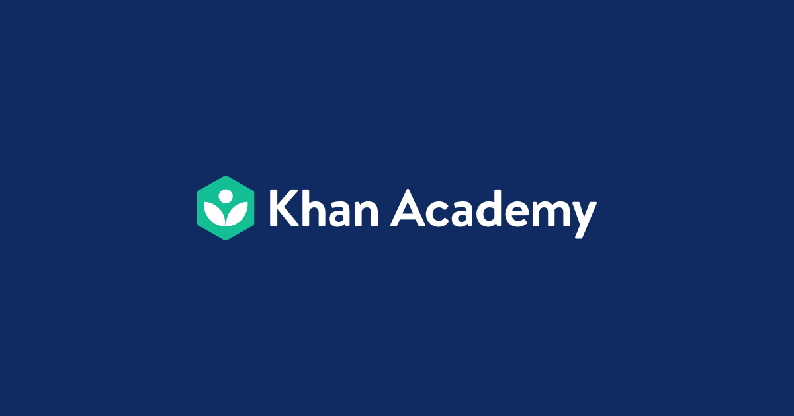

<p align="center">
  
</p>

# Khan Academy MCP Server

An open-source [Model Context Protocol](https://modelcontextprotocol.io) (MCP) server that lets AI assistants search, browse, and read Khan Academy's educational content. No API key required.

## Quick Start

```bash
npx khanmcp
```

Or install globally:

```bash
npm install -g khanmcp
khanacademy-mcp
```

## Claude Desktop Configuration

Add this to your Claude Desktop config (`~/Library/Application Support/Claude/claude_desktop_config.json` on macOS):

```json
{
  "mcpServers": {
    "khanacademy": {
      "command": "npx",
      "args": ["-y", "khanmcp"]
    }
  }
}
```

## Tools

| Tool | Description |
|------|-------------|
| `search` | Search Khan Academy for videos, articles, exercises, and courses |
| `list_subjects` | List all top-level subjects and popular courses |
| `get_topic_tree` | Browse the subject/topic hierarchy by slug with configurable depth |
| `get_content` | Get details about a specific content item (video, article, exercise) |
| `get_course` | Get full course structure with units, lessons, and content items |
| `get_transcript` | Get video transcripts (timestamped or full text) |
| `get_article` | Read the full text content of a Khan Academy article |
| `get_lesson` | Get all content items in a specific lesson |
| `embed_video` | Embed a video with thumbnail image, metadata, chapters, and optional transcript |
| `get_exercise` | Get exercise details with related study content (videos, articles) and practice URL |
| `get_quiz` | List all quizzes, unit tests, and course challenge for a course with prep material |
| `study_guide` | Build a structured study plan for any topic |

### Tool Details

#### `search`
```
query: string    — Search query (e.g., "photosynthesis", "quadratic formula")
limit?: number   — Max results (1-30, default: 10)
```

#### `list_subjects`
No parameters. Returns all top-level subjects and popular courses.

#### `get_topic_tree`
```
slug: string     — Topic slug (e.g., "math", "science/biology")
depth?: number   — Levels to fetch (0-3, default: 1)
```

#### `get_content`
```
slug: string     — Content slug or full URL
```

#### `get_course`
```
slug: string     — Course slug or URL (e.g., "math/algebra")
```

#### `get_transcript`
```
slug: string     — Video slug, KA URL, YouTube URL, or YouTube ID
language?: string — Language code (default: "en")
format?: string  — "full", "timestamped", or "both" (default: "full")
```

#### `get_article`
```
slug: string     — Article slug or full URL (articles have "/a/" in the path)
```

#### `get_lesson`
```
slug: string     — Lesson slug or full URL
```

#### `embed_video`
```
slug: string              — Video slug, KA URL, YouTube URL, or YouTube ID
include_transcript?: bool — Include the full transcript (default: false)
language?: string         — Language code for transcript (default: "en")
```

#### `get_exercise`
```
slug: string     — Exercise slug or full URL (exercises have "/e/" in the path)
```

#### `get_quiz`
```
slug: string     — Course slug or URL (e.g., "math/algebra")
kind?: string    — "all", "quiz", "unit-test", or "course-challenge" (default: "all")
```

#### `study_guide`
```
topic: string    — Topic or concept to study (e.g., "quadratic equations")
depth?: string   — "quick", "standard", or "comprehensive" (default: "standard")
```

## Workflows

**Topic exploration:**
`list_subjects` → `get_topic_tree` → `get_course` → `get_lesson` → `get_content` / `get_transcript`

**Quick lookup:**
`search` → `get_content` or `get_article` → `get_transcript` (if video)

**Study session:**
`search` or `get_topic_tree` → `study_guide` for review, then `get_article` / `get_transcript` for deep dives

**Course overview:**
`get_course` → pick a unit/lesson → `get_lesson` → `get_content`

**Test prep:**
`get_quiz` → review covered lessons → `get_exercise` for practice → `get_transcript` / `get_article` to study weak areas

## Development

```bash
git clone https://github.com/aicoder2009/khanacademyMCP.git
cd khanacademyMCP
npm install
npm run build
```

Test with:
```bash
echo '{"jsonrpc":"2.0","id":1,"method":"tools/list"}' | node dist/index.js
```

## How It Works

Khan Academy deprecated their public API in 2020. This MCP server uses:

- **Khan Academy's internal GraphQL API** — safelisted queries for content metadata and search
- **YouTube transcript API** — fetches video captions/subtitles
- **Page scraping** — extracts structured data from Khan Academy web pages as a fallback
- **Static catalog** — hardcoded top-level subjects for reliable `list_subjects`

All access is read-only with rate limiting (500ms between requests) and in-memory caching to be respectful of Khan Academy's servers.

## Limitations

- No authentication — cannot access user-specific data (progress, recommendations)
- Khan Academy's internal API may change without notice — static fallbacks ensure basic functionality
- Transcript availability depends on YouTube captions being present
- Rate-limited to avoid overloading Khan Academy's servers

## License

MIT
